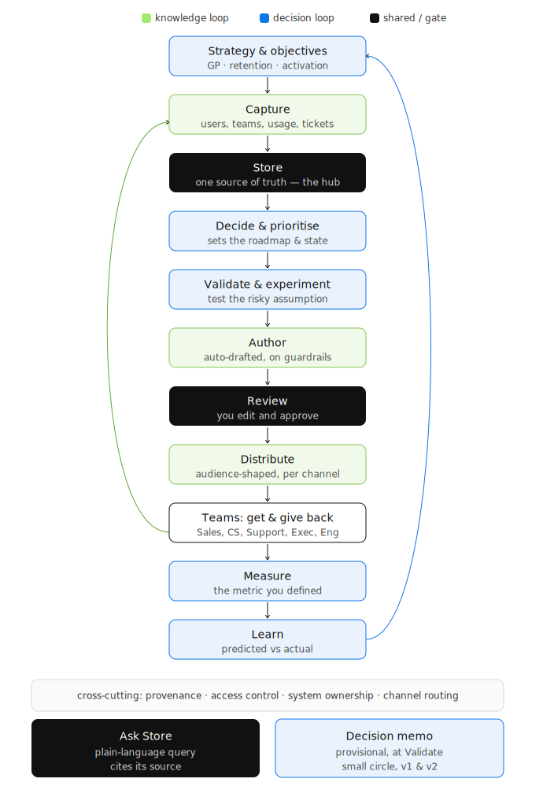
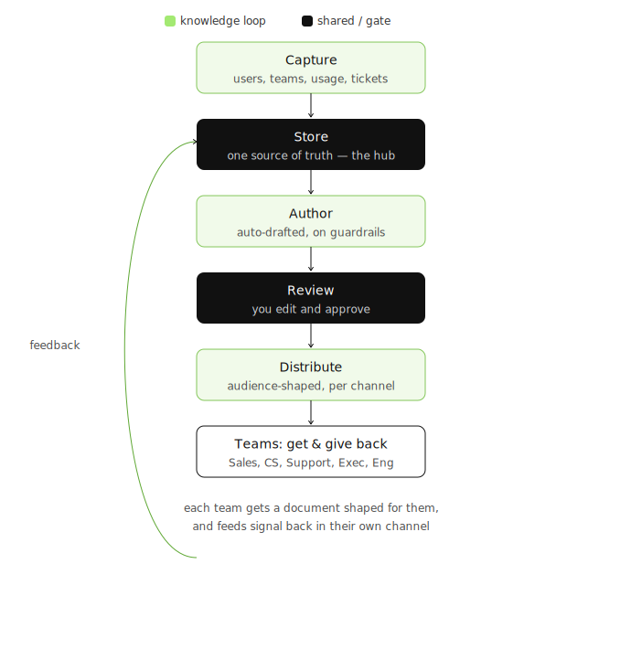
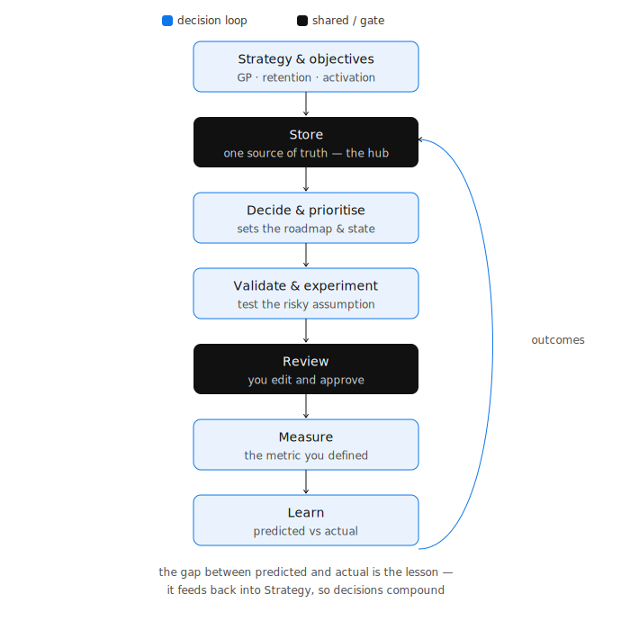
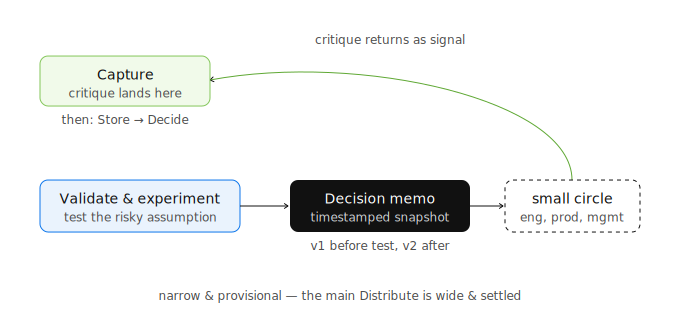
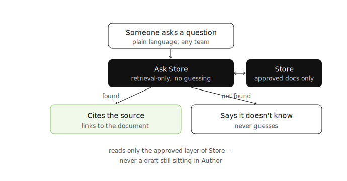
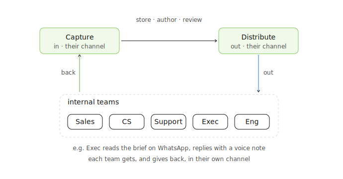

# **A framework for running product work with AI tooling**

This framework is a way of running product management work so AI does the heavy lifting and a person still owns every decision. This walkthrough covers what it is, why it helps, and how the workflow fits together, layer by layer.

# **The framework in one idea**

I have been more than a little obsessed with the work [Sarah Winter's](https://www.linkedin.com/in/sarahwinterscontentstrategist/) and her team are doing at [Content Design London](https://contentdesign.london/). Their work on [Content Design](https://contentdesign.london/blog/why-content-design-exists) has changed the way I work entirely and I've used their principles here to start thinking about how product teams may work alongside AI tooling. 

Simply put, I've pointed the discipline of content design inward, at my own work and the work of the teams I run. 

`Content design means giving people the exact content they need, in a form they can use, based on evidence of what they are trying to do.`

Most teams aim that at customers. This framework aims it at the product manager's own process: the research, the decisions, the specs, and the updates other teams depend on. Heavily guided AI tooling gathers the raw material and drafts the outputs. The person reviews, decides, and approves. Everything traces back to one shared record.

## **The problem it removes**

Every product team has the same leak.

Decisions live in one person's head, so they get re-argued or accidentally reversed. Documents drift out of date, so people act on stale information. Sales promises one thing while the roadmap says another, and engineering absorbs the gap as rushed rework. Insight arrives in a quarterly rush instead of arriving continuously.

This is often not a people problem but a missing system.

Faster documents do not help if a team is acting on the wrong decision. The fix is the loop: make a better call, record it once, deliver it to each team in a form they will actually use, measure what happens, and feed that back in.

The framework helps your team hold one queryable source of truth — one place where the real evidence and reasoning live — and generates everything else from it. Decisions get recorded, teams stay aligned, insight stays current, and debt stops piling up.

## **The whole workflow, in one diagram**

*The full workflow (the master view, updated to include the decision memo loop and the Store query node).*

The workflow runs top to bottom. Two loops move through it, and they share one hub.

The knowledge loop moves raw signal into a shared record, turns it into documents, and sends those out to the teams.

The decision loop sets the goal, makes the call, tests it, measures the result, and learns from it.

Both loops read from and write to the same hub, called Store. Both pass through one human checkpoint, called Review. Colour tells the two apart in every diagram here: teal for the knowledge loop, purple for the decision loop.

Two more things sit close to Store, and each gets its own section below: a decision memo that circulates early, while a call is still being tested, and a way to query Store directly, in plain language, at any time.

## **The knowledge loop**

*The knowledge loop: Capture, Store, Author, Review, Distribute as one teal strand, plus the return arrow from the teams back to Capture.*

**Capture** — takes in signal from every source, in whatever form it arrives: product metrics from an API, meeting transcriptions, a support ticket, a sales note, a voice message from an exec, raw usage data. It meets people where they are instead of forcing everything into one channel.

**Store** — the shared record, and the hub of the whole system. One place where the real evidence and reasoning live. Everything downstream is generated from it rather than copied by hand, so nothing drifts out of sync.

**Author** — AI drafts the working documents straight from Store: decision logs, research summaries, specifications, work logs. Guardrails keep the record honest, so it is dated to the real work and hard to rewrite.

**Review** — the human checkpoint. AI drafts; a person edits, decides, and approves. Nothing leaves this step without judgment behind it.

**Distribute** — sends each team the document it needs, shaped for that team and delivered in the channel they use. Because every version is generated from Store, the teams never end up working from conflicting copies.

## **The decision loop**

*The decision loop: Strategy, Decide, Validate, Measure, Learn as one purple strand, sharing Store and Review, with the return arrow from Learn back to Strategy.*

The decision loop shares Store and Review with the knowledge loop. It adds the parts that make and test a call.

**Strategy and objectives** — the yardstick. The numbers this product area exists to move, such as gross profit, retention, and activation. Every later decision is judged against them.

**Decide and prioritise** — the call itself. Weigh the options against the objectives, choose what to build and in what order, and record why the other options were deprioritised. This is what sets the roadmap.

**Validate and experiment** — test the riskiest assumption cheaply before committing to it. My own approach here, as the product manager, is to spin up the test myself: build the MCP layers, use n8n and a bit of code, and move as fast as I can. A small test produces fresh evidence, which flows straight back into Store.

**Measure** — choose the success metric at the moment you make the decision, then set up the measurement and watch it after launch. The metric is set up front, not reverse-engineered later.

**Learn** — compare what you predicted with what actually happened. The gap is the lesson, and it feeds back into strategy and the next decision, so decisions get better over time.

## **The decision memo: a provisional distribution, while the call is still in flight**

*The decision memo loop: Validate branching right to the memo, out to a small circle, back through Capture.*

Distribute is not the only point where a document leaves the system. At Validate, before a decision is settled, I circulate a decision memo: a timestamped snapshot of the thinking so far. The riskiest assumption, how it is being tested, what I am assuming, what I expect to see.

This goes to a small circle, not the whole company: engineering, product peers, and the management layer above. Their job is to pressure-test the thinking, not to sign off on a finished decision.

It runs in two versions, not one. The first goes out before the test, with the assumptions and the test plan, so the circle can catch a bad test before it costs any effort. The second goes out after, with what was found and what I now think, for a final check. Both versions are just Author's existing guardrails at work: dated, and hard to quietly rewrite after the fact.

Whatever comments come back are signal, so they come in the same way as everything else: through Capture, then into Store, sharpening the decision before it is finalised.

The difference between this and Distribute is temperature, not mechanism. Distribute is wide and settled: it tells a large audience a decision is made. The decision memo is narrow and provisional: it asks a small audience to find the holes before the decision is made.

## **Ask Store directly**

*A small sidecar node beside Store, labelled "ask a question," with its three rules shown as a short legend.*

Distribute is one route out of Store: push, on a schedule, shaped for each team. There is a second route: pull, on demand, in plain language. Anyone can ask Store a direct question — "what did we decide about X", "what's the status of Y" — and get an answer sourced from the real documents.

Three rules keep this honest:

- it answers only from documents that are actually in Store, never from general knowledge
- every answer names and links to the document it came from
- if nothing in Store covers the question, it says so, rather than guessing

This only reads from the approved layer of Store, after Review, never from drafts still in Author. A half-finished draft is not yet true, and this must never present it as if it were.

The benefit compounds. Small, in-the-moment questions no longer wait for a scheduled Distribute or a message to the product manager. The source of truth becomes something a person can interrogate directly, not something only one person can navigate.

## **The teams, both ways**

*The team hinge (the close-up built earlier).*

The teams are not the end of the line. The same people who receive documents are the freshest source of signal you have, so the arrow runs both ways. Distribute sends out in each person's preferred format. Capture takes feedback back in that same format.

An exec who gets a briefing on WhatsApp can reply with a voice note in seconds. Ask the same person to log into a tool and complete a form, and you get silence. The channel decides whether feedback happens at all, so the framework treats each person's channel as part of the design.

## **Properties that run through every layer**

Four things apply to every layer, so they sit across the whole framework rather than inside any single step:

- provenance — every output can be traced back to the evidence that justified it, including every answer given through Ask Store
- access control — who can see what, with sensitive material such as personal data or exec-only notes kept protected
- system ownership — one person keeps the system itself healthy, with prompts current, tags tidy, and stale evidence archived
- channel routing — each person's preferred platform and format, used both to send to them and to hear back from them, including the small circle who receive the decision memo

# **Why this is content design, not admin**

It is easy to mistake this for tidy paperwork. It is not. One shared record with generated outputs removes three kinds of debt at once:

- documentation debt — docs go stale and start to contradict each other
- strategic debt — decisions get re-argued, or built over
- technical debt — teams act on mismatched information, and someone patches the gap under deadline

Removing all three is what lets a team move fast without the mess building up. The decision memo adds a fourth defence, earlier in the process: it catches a flawed test before it runs, rather than a flawed decision after it ships.

There is a second point worth stating plainly. This framework is a product built for the people who build products. It treats the product manager's own process as something worth designing. It has real users — the product manager and the internal teams — and shapes the content to what each of them needs. It also puts AI to work in how the product gets built, not only in what the product does for customers.