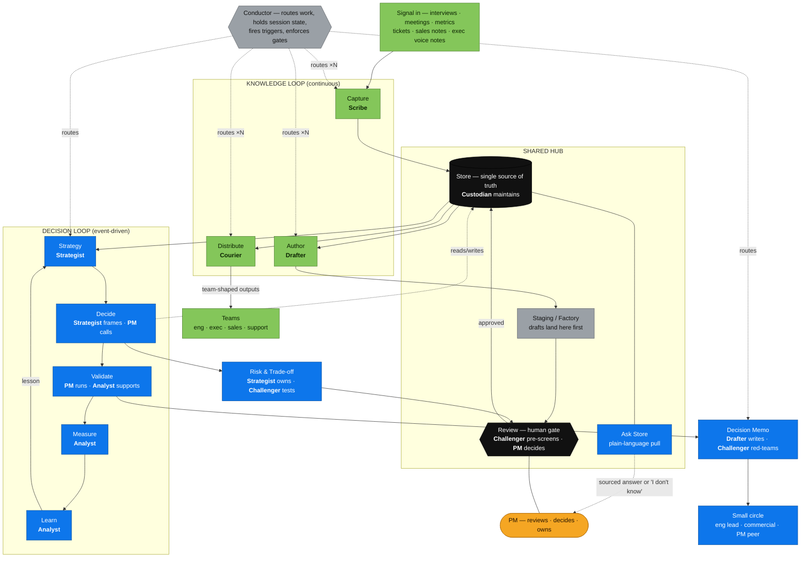
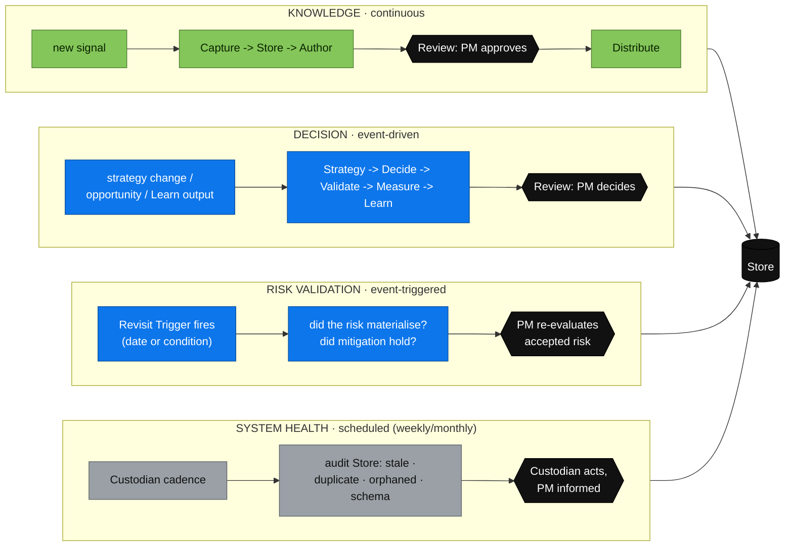
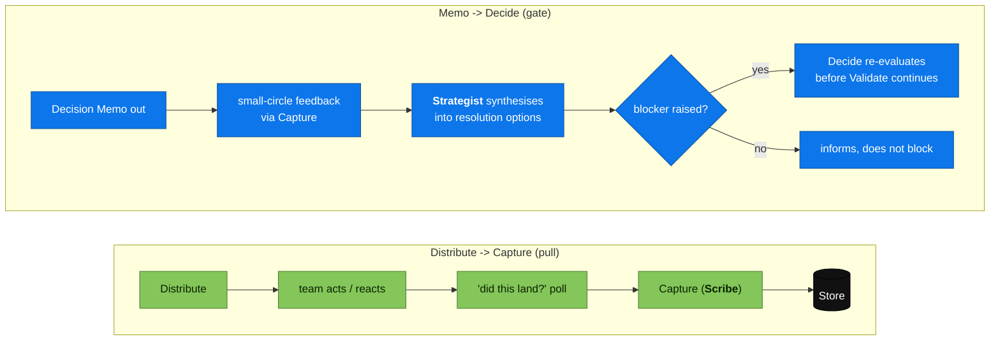
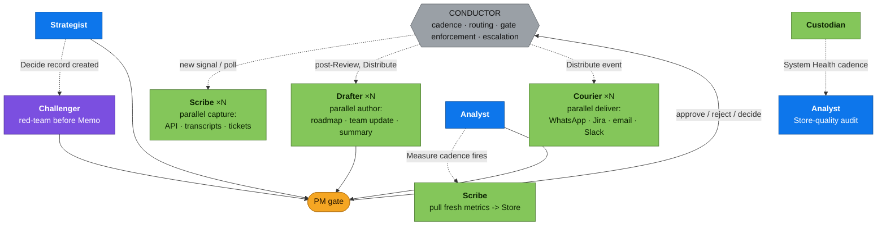
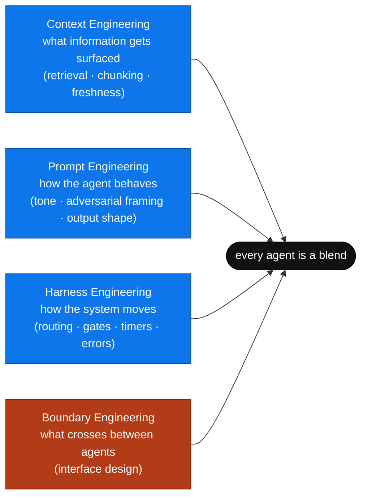
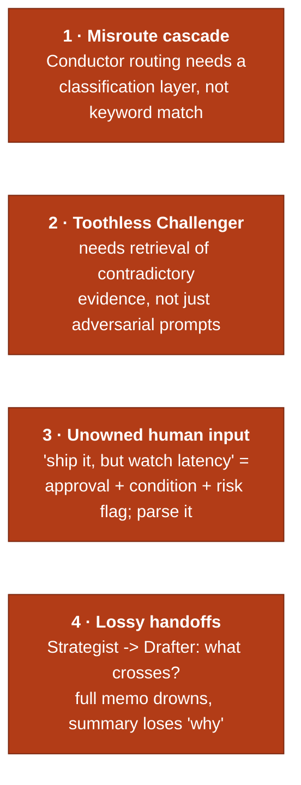
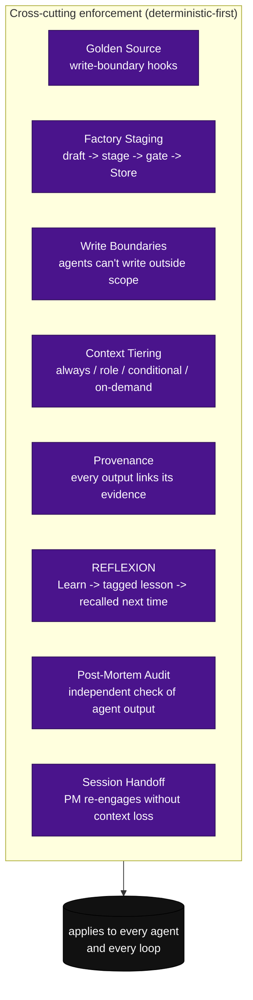
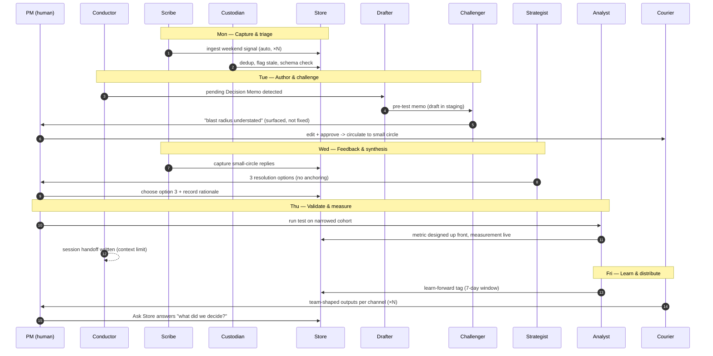

# Agentic Product Management ✦ A framework for running product work with AI tooling

This is a system for running product management work so AI does the heavy lifting and a person still owns every decision.

It has two halves. The framework defines what happens: signal is captured into one shared record (Store), AI drafts the documents a team needs, a person reviews and approves, and outputs are distributed to each team in the channel they already use. The harness defines who does it: eight specialised agents (Scribe, Custodian, Drafter, Courier, Strategist, Analyst, Challenger, and a Conductor that routes but never writes).

Four feedback loops run through it, all sharing one source of truth and one human review gate:

- knowledge ✦ turns raw signal into documents and sends them to the teams (continuous)
- decision ✦ sets goals, makes the call, tests it, measures, and learns (event-driven)
- risk validation ✦ re-checks accepted risks when a revisit trigger fires (event-triggered)
- system health ✦ audits the shared record for stale, duplicate, or orphaned entries (scheduled)

Underneath sits an enforcement layer of deterministic rules — staging before Store, write boundaries, provenance, active recall — that stops the system decaying when agents or people take shortcuts. The whole thing applies the discipline of content design inward, at the product manager's own process, removing four kinds of debt at once: documentation, strategic, technical, and risk.

This README covers the whole system: the idea, the two loops, the shared hub, the satellites, the eight agents that staff it, the loops the design was missing, and the enforcement that keeps it from decaying. Every part is drawn as a diagram, with a short text summary beside it.

If you only want the concept, read **The framework in one idea** and **The whole system in one diagram**, then stop. If you want to build it, keep going.

## Colour key

Every diagram uses the same colours. Colour is never the only signal — each node is also labelled in text.

| Colour | Meaning |
|--------|---------|
| Green | Knowledge loop ✦ Capture, Store, Author, Review, Distribute |
| Blue | Decision loop ✦ Strategy, Decide, Validate, Measure, Learn |
| Black | Shared hub ✦ Store and Review, used by both loops |
| Grey | Infrastructure ✦ the Conductor, which routes but produces no content |
| Orange | Human ✦ the product manager, who owns every gate |
| Purple | Spans both loops ✦ the Challenger, plus the enforcement spine |
| Red | Boundary failures ✦ where the system breaks first |

## The framework in one idea

The discipline of [content design](https://contentdesign.london/blog/why-content-design-exists), from [Sarah Winters](https://www.linkedin.com/in/sarahwinterscontentstrategist/) and [Content Design London](https://contentdesign.london/), asks one question before any writing starts: what does the reader actually need, and what is the best form to meet it? This framework points that question inward — at the product manager's own process rather than at customers.

> Content used to be something you read. Now it's something you use. Content design is about giving your audience what they want, when they need it, in the way they expect. — Sarah Winters

Most teams aim that at customers. This framework aims it at the research, the decisions, the specs, and the updates other teams depend on.

## The problem it removes

Every product team has the same leak. Decisions live in one person's head, so they get re-argued or reversed. Documents drift out of date, so people act on stale information. Sales promises one thing while the roadmap says another, and engineering absorbs the gap as rushed rework. Insight arrives in a quarterly rush instead of continuously.

This is a missing system, not a people problem. Faster documents do not help if a team is acting on the wrong decision.

The fix is the loop: make a better call, record it once, deliver it to each team in a form they will use, measure what happens, and feed that back in. Hold one queryable source of truth, and generate everything else from it.

## A worked example

One small workflow shows the shape of the whole thing. Customer interview recordings, Google Meet transcripts, product metrics from APIs, support tickets, and sales conversations all flow into Capture, where AI organises them into the shared record.

From there, AI drafts research summaries, prioritisation recommendations, a roadmap, and team-specific updates. The PM reviews them before they go out to each team in the tools they already use.

The exec receives a concise roadmap update on WhatsApp and replies with a voice note. That reply is transcribed automatically and fed back into Capture, where it becomes evidence for the next round of decisions — closing the loop. In practice the orchestration layer runs on something like n8n, but the tool is an implementation detail, not part of the design.

## The whole system in one diagram

The framework says *what* happens (the steps). The harness says *who* does it (the agents). The PM owns every gate. The Conductor routes everything and produces no content.

*Diagram summary: signal flows into Capture and lands in Store. From Store, the knowledge loop authors drafts, stages them, passes the human Review gate, and distributes team-shaped outputs. From Store, the decision loop runs Strategy, Decide, Validate, Measure, and Learn, feeding lessons back to Strategy. Two satellites branch off: a Risk & Trade-off record from Decide, and a Decision Memo from Validate to a small circle. Ask Store pulls sourced answers on demand. The Conductor routes work to every agent but writes no content.*

## Where to start building

Not everything is built at once. This sequence follows dependencies — each phase produces something usable.

| Phase | Build | Delivers |
|-------|-------|----------|
| 1 | Store + Scribe + Custodian | A working knowledge base with ingestion and maintenance |
| 2 | Drafter + Conductor | Documents generated from Store, with basic routing |
| 3 | Challenger | Adversarial review before the PM sees anything |
| 4 | Strategist + Analyst | A working decision loop with measurement and learning |
| 5 | Courier | Channel-aware delivery, completing the knowledge loop |
| 6 | Ask Store | A plain-language query interface on Store |

A solo PM at low volume does not need eight agents on day one. The minimum viable harness is **Store + Scribe + Drafter** — the PM plays Challenger, Strategist, and Analyst, which is what they already do. Add each agent when its absence starts costing PM attention. Below the full-team threshold, fewer agents with the PM filling the gaps is not a compromise — it is the right configuration.

## The knowledge loop

The knowledge loop moves raw signal into the shared record, turns it into documents, and sends those to the teams. It runs continuously.

- **Capture** ✦ takes in signal from every source, in whatever form it arrives: metrics from an API, meeting transcripts, a support ticket, a sales note, an exec's voice message
- **Store** ✦ the shared record and the hub of the whole system, the one place the real evidence and reasoning live
- **Author** ✦ AI drafts working documents straight from Store: decision logs, research summaries, specifications, work logs
- **Review** ✦ the human gate, where a person edits, decides, and approves; nothing leaves without judgment behind it
- **Distribute** ✦ sends each team the document it needs, shaped for that team, in the channel they already use

Because every version is generated from Store, teams never work from conflicting copies.

## The decision loop

The decision loop sets the goal, makes the call, tests it, measures the result, and learns from it. It shares Store and Review with the knowledge loop, and it is event-driven rather than continuous.

- **Strategy** ✦ the yardstick: the numbers this product area exists to move, such as gross profit, retention, and activation
- **Decide** ✦ the call itself: weigh the options against the objectives, choose what to build and in what order, and record why the rest were deprioritised
- **Validate** ✦ test the riskiest assumption cheaply before committing; the PM spins the test up directly to stay closest to the evidence
- **Measure** ✦ choose the success metric at the moment of the decision, then set up measurement and watch it after launch
- **Learn** ✦ compare prediction with outcome; the gap is the lesson, and it feeds back into strategy and the next decision

## The satellites

Three mechanisms sit close to Store, each serving a need the two loops do not cover on their own.

### Decision memo

At Validate, before a decision is settled, the PM circulates a timestamped snapshot of the thinking so far: the riskiest assumption, how it is being tested, what is assumed, what is expected. It goes to a small circle — engineering, product peers, the management layer — whose job is to pressure-test, not to sign off.

It runs in two versions: one before the test, so the circle can catch a bad test before it costs effort, and one after, with what was found. Comments return through Capture like any other signal. The difference between a memo and Distribute is temperature, not mechanism: Distribute is wide and settled, the memo is narrow and provisional.

### Ask Store

Distribute is the push route out of Store — scheduled, shaped per team. Ask Store is the pull route: anyone can ask a plain-language question and get an answer sourced from the real documents. Three rules keep it honest:

- it answers only from documents actually in Store, never from general knowledge
- every answer names and links the document it came from
- if nothing in Store covers the question, it says so rather than guessing

It reads only the approved layer of Store, after Review, never drafts still in Author. A half-finished draft is not yet true.

### Risk and trade-off

Decide sets the direction and Validate tests it, but the *cost* of a choice rarely gets written down in the same disciplined way. Risk & Trade-off sits alongside Decide the way the memo sits alongside Validate. The moment a Decide record is created, Author drafts a record from Store — known dependencies, how similar past decisions played out, how solid the evidence is. Each record holds a consistent shape:

- **the risk** ✦ named plainly
- **reversibility** ✦ a one-way or two-way door, which alone sets how much scrutiny it gets
- **blast radius** ✦ who or what breaks if this is wrong
- **the call** ✦ accept, mitigate, avoid, or transfer, stated outright
- **the reasoning** ✦ in the PM's own words, so it's a decision and not a checkbox
- **an owner**
- **a revisit trigger** ✦ a date or condition that forces a second look

This is **risk debt**: the cost of a choice arriving later as a surprise, to someone who never got to weigh in on whether it was worth taking.

## The teams, both ways

The teams are not the end of the line. The same people who receive documents are the freshest source of signal, so the arrow runs both ways. Distribute sends out in each person's preferred format. Capture takes feedback back in that same format.

An exec who gets a briefing on WhatsApp can reply with a voice note in seconds. Ask the same person to log into a tool and complete a form, and you get silence. The channel decides whether feedback happens at all, so the framework treats each person's channel as part of the design.

## Four loops, not two

A review of the framework found that it *described* three feedback circuits but never drew them as closed loops — so revisit triggers rot, Store decays, and team feedback depends on someone choosing to speak up. Formalising them gives four loops, each with its own cadence and trigger, each passing a human gate.

*Diagram summary: four loops all write back to Store. The knowledge loop runs continuously. The decision loop is event-driven. The risk validation loop fires when a revisit trigger's date or condition is met, and asks whether an accepted risk materialised. The system health loop runs on a schedule to audit Store for stale, duplicate, orphaned, or off-schema records.*

## The pull loops the review added

Generation was already strong: AI drafts, a human reviews. What was missing were the signals that tell you something has gone stale, unread, or contested.

*Diagram summary: two pull loops. The first turns Distribute into a source of signal — a "did this land?" poll flows back through Capture into Store. The second turns memo feedback into a gate — the Strategist synthesises small-circle comments into resolution options, and if a blocker is raised, Decide re-evaluates before Validate continues; otherwise the feedback informs without blocking.*

## The eight agents

The framework defines *what* happens. The harness defines *who* does it. Eight agents staff the loops — the minimum that gives each step a clear owner without collapsing distinct capabilities into one overloaded role. Each is stateless except the Conductor, which holds session state as infrastructure, not authority.

| Agent | Primary capability | Steps served | Colour |
|-------|-------------------|---------------|--------|
| **Scribe** | Ingestion and transcription | Capture | Green |
| **Custodian** | Store maintenance, dedup, schema, index | Store, System Ownership | Green |
| **Drafter** | Document generation from Store | Author, Decision Memo | Green |
| **Courier** | Channel-aware delivery and format shaping | Distribute, Channel Routing | Green |
| **Strategist** | Objectives, option framing, feedback resolution | Strategy, Decide (framing) | Blue |
| **Analyst** | Metric design, measurement, learn-forward tagging | Validate, Measure, Learn | Blue |
| **Challenger** | Adversarial review and risk surfacing | Review (adversarial), Risk & Trade-off | Purple (spans both) |
| **Conductor** | Routing, session state, triggers, gates | Infrastructure — no step | Grey |

Two rules hold across all of them: **the PM owns every decision** (agents draft, challenge, and organise; a person reviews, decides, and approves), and **Store is the single source of truth** (agents read from and write to Store, and no agent keeps a private record that contradicts it).

### Who is responsible for what

One Responsible agent per workflow, with the PM Accountable for every decision-bearing step.

| Workflow | Responsible | PM role |
|----------|-------------|---------|
| Capture | Scribe | Informed |
| Store maintenance | Custodian | Informed |
| Author | Drafter | Accountable |
| Review (adversarial) | Challenger | Accountable |
| Review (editorial) | PM | Responsible |
| Distribute | Courier | Accountable |
| Strategy | Strategist | Accountable |
| Decide (framing) | Strategist | Accountable |
| Decide (final call) | PM | Responsible |
| Risk & Trade-off | Strategist | Accountable |
| Validate | PM | Responsible |
| Measure | Analyst | Accountable |
| Learn | Analyst | Accountable |
| Decision Memo | Drafter | Accountable |
| Ask Store | Custodian (index) | Informed |

## Orchestration and parallel spawning

The Conductor is infrastructure — it decides *when* and *where*, never *what*. Much of the work fans out into parallel stateless subagents, shown as ×N.

*Diagram summary: the Conductor fans work out to parallel agents — many Scribes capturing at once, many Drafters authoring at once, many Couriers delivering across channels at once. Agents also trigger each other: a Decide record wakes the Challenger, a Measure cadence wakes a Scribe, a system-health cadence wakes an Analyst. Everything decision-bearing lands at the PM gate, and the PM's approve, reject, or decide flows back to the Conductor.*

## The four engineering disciplines

Every agent is a blend of four engineering disciplines. The ratio differs by agent, and the boundaries between agents are where production bugs live first.

*Diagram summary: four disciplines feed every agent. Context engineering controls what information is surfaced. Prompt engineering controls how the agent behaves. Harness engineering controls how the system moves. Boundary engineering — added after the review — controls what crosses between agents, and is where the four failures below live.*

### The four boundary failures to engineer against

*Diagram summary: four failures at the boundaries. A misroute cascade when the Conductor matches keywords instead of classifying. A toothless Challenger with rhetoric but no evidence. Unowned human input, where "approved with conditions" is captured as a bare "approved". And lossy handoffs, where the reasoning behind options is dropped between agents.*

## The enforcement spine

The review's core verdict: the framework's design is sound, but it lacks the enforcement that stops it degrading when agents or humans take shortcuts. These patterns run across every layer as deterministic code, not prompts.

*Diagram summary: eight enforcement patterns apply to every agent and loop. Golden Source and Factory Staging keep Store clean. Write Boundaries and Context Tiering control what each agent can touch and see. Provenance, REFLEXION, and Post-Mortem Audit keep outputs traceable, make lessons compound, and check quality independently. Session Handoff lets the PM re-engage without losing context.*

Priority by effort against impact: **Deterministic-First** and **Factory Staging** are low-effort and high-impact — build them first. Write Boundaries, Context Tiering, and REFLEXION are the high-impact structural changes after that.

## A typical week

Where the PM actually touches the work. Everything else is agent-driven.

*Diagram summary: across a week, the PM touches the work at four points — approving a memo for circulation on Tuesday, choosing a resolution option on Wednesday, running the test on Thursday, and reviewing distributed outputs on Friday. Everything else — capture, dedup, drafting, challenging, measuring, tagging, and delivery — runs through the agents, with a session handoff written automatically when a context limit is reached.*

## From framework step to agentic system

The through-line is unchanged: AI does the heavy lifting, a person owns every decision, everything traces back to one Store. The harness turns described intentions into mechanisms — named owners, closed loops, an orchestration model, an engineering lens that predicts where it breaks, and an enforcement spine that stops it decaying.

| Framework step or property | Agent | PM role |
|----------------------------|-------|---------|
| Capture | Scribe | Informed |
| Store + System Ownership | Custodian | Informed |
| Author + Decision Memo | Drafter | Accountable |
| Review (adversarial) | Challenger | Accountable |
| Review (editorial) | — | Responsible |
| Strategy + Decide (framing) | Strategist | Accountable |
| Decide (final call) | — | Responsible |
| Validate | Analyst (support) | Responsible |
| Measure + Learn | Analyst | Accountable |
| Risk & Trade-off | Strategist (Challenger tests) | Accountable |
| Distribute + Channel Routing | Courier | Accountable |
| Routing, cadence, gates | Conductor | — |
| Ask Store (pull) | Custodian indexes | Informed |

## Properties that run through every layer

Four things apply to every layer, so they sit across the whole system rather than inside any single step:

- **provenance** ✦ every output traces back to the evidence that justified it, including every Ask Store answer
- **access control** ✦ who can see what, with sensitive material such as personal data or exec-only notes kept protected
- **system ownership** ✦ one person keeps the system healthy, with prompts current, tags tidy, and stale evidence archived
- **channel routing** ✦ each person's preferred platform and format, used both to send to them and to hear back from them

## Why this is content design, not admin

It is easy to mistake this for tidy paperwork. It is not. One shared record with generated outputs removes four kinds of debt at once:

- **documentation debt** ✦ docs go stale and start to contradict each other
- **strategic debt** ✦ decisions get re-argued, or built over
- **technical debt** ✦ teams act on mismatched information, and someone patches the gap under deadline
- **risk debt** ✦ the cost of a choice arrives later as a surprise, to someone who never got to weigh in

Removing all four is what lets a team move fast without the mess building up.

There is a second point worth stating plainly. This is a product built for the people who build products. It treats the product manager's own process as something worth designing, with real users — the PM and the internal teams — and shapes the content to what each of them needs. It puts AI to work in how the product gets built, not only in what the product does for customers.

