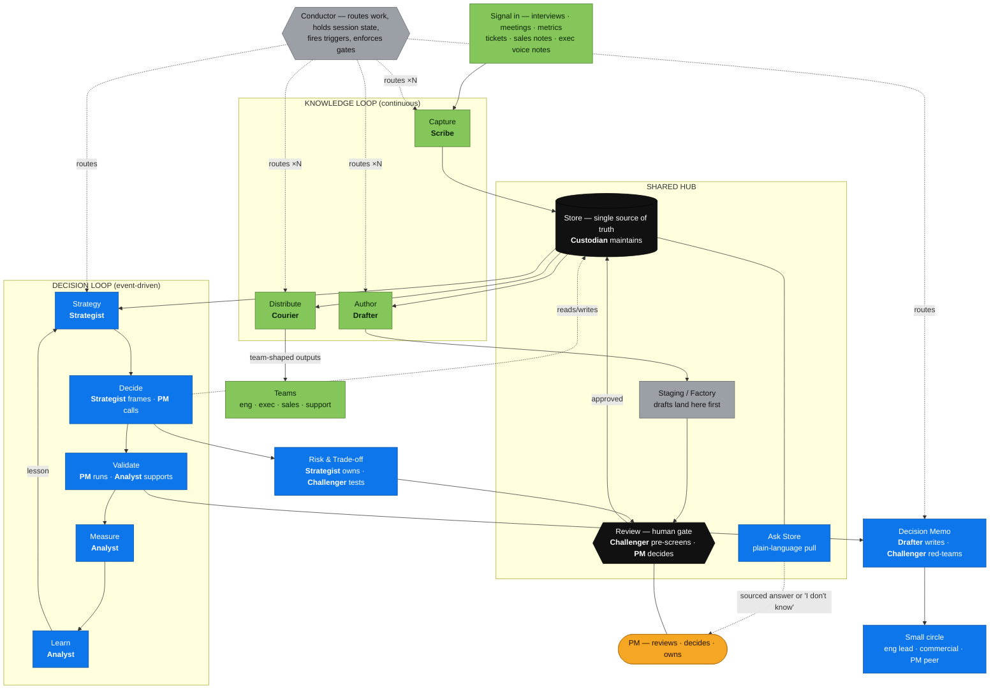
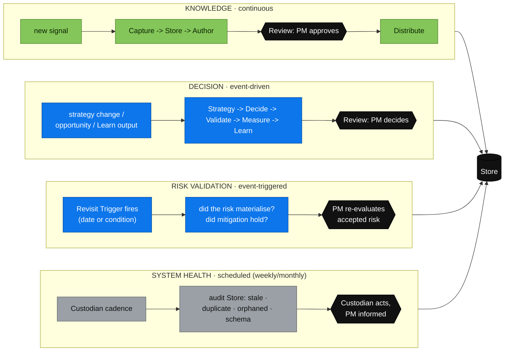
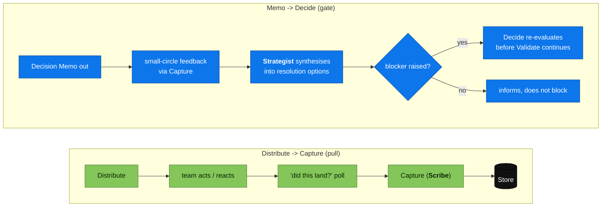
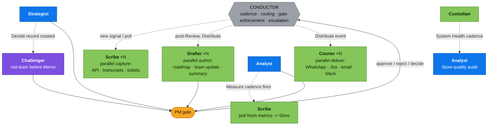
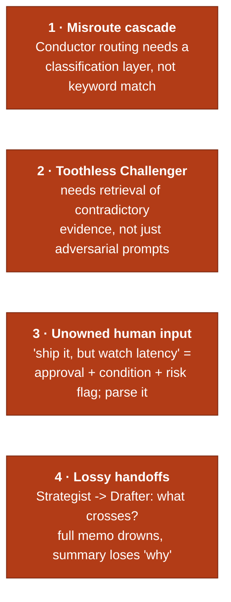
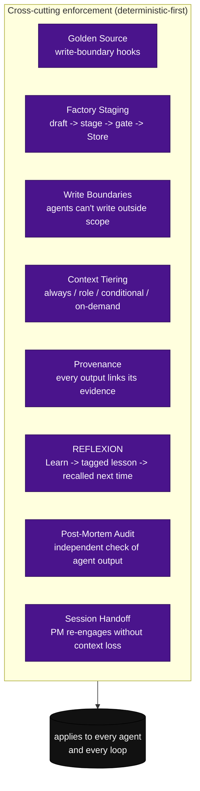
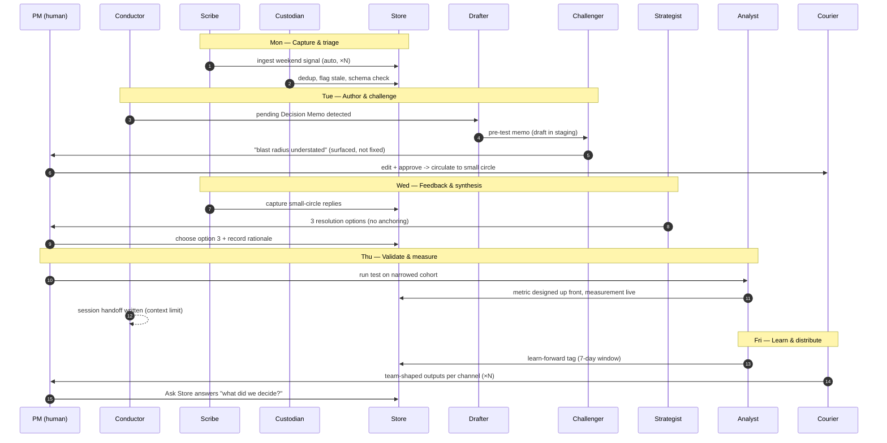

# The Agentic AI Product Framework — Visual

This visualises the **reviewed, agentic** version of the framework end to end. It
combines four bodies of work, all of which are *yours* (the SINGULARITY / Kirk
material was reference only and is excluded):

1. **The framework** — the original two loops, shared hub, and satellites
   (README / `ai-pf-01..12`).
2. **The harness** — eight agents that *staff* the framework
   ([[implementation-proposal]], [[agents]]).
3. **The closure** — the feedback loops the review found missing
   ([[analysis]]).
4. **The engineering lens** — the four disciplines every agent blends, and where
   the system will fail ([[fourcriticalgaps]], [[transferrable_rules]]).

> **Colour key:** green = knowledge loop · blue = decision loop · black = shared
> hub · grey = infrastructure (Conductor) · orange = human (PM) · purple =
> spans both loops (Challenger).
>
> **Naming note:** the delivery agent is **Courier** across all diagrams and the
> RACI (alias "Distributor" appears in the prose proposal — same agent).

---

## 1. The whole system in one diagram

The framework says *what* happens (the steps). The harness says *who does it*
(the agents). The PM owns every gate. The Conductor routes everything and
produces no content.



---

## 2. The four execution loops (cadence · trigger · gate)

The system runs **four** loops, not two. The original two are joined by the two
the review formalised. Each has a different cadence and a different trigger, but
every one passes a human gate.



**The gaps this closed** (from [[analysis]]): the original framework *described*
Risk→Learn, System Health, and Distribute→Capture but never drew them as closed
loops — so revisit triggers rot, Store decays, and team feedback depends on
someone choosing to speak up. Loops 3 and 4 above formalise the first two; the
Distribute→Capture pull ("did this land?") and the Memo→Decide gate ("do these
comments block or merely inform?") are shown next.

---

## 3. The pull loops the review added (degradation signals)

Generation was strong (AI drafts → human reviews). What was missing were the
signals that tell you something has gone **stale, unread, or contested**.



---

## 4. Orchestration & parallel spawning

The Conductor is infrastructure — it decides *when* and *where*, never *what*.
Much of the work fans out into parallel stateless subagents (×N).



---

## 5. The four engineering disciplines (where the real work — and the bugs — live)

Cassandra's review reframed the harness: every agent is a **blend** of four
engineering disciplines, and *the boundaries between agents are where production
bugs live first*. This is the "Revised Layer Map (post-Cassandra)".

- **Context Engineering** — what information gets surfaced (retrieval, chunking, freshness).
- **Prompt Engineering** — how the agent behaves (tone, adversarial framing, output shape).
- **Harness Engineering** — how the system moves (routing, gates, timers, error handling).
- **Boundary Engineering** — what crosses between agents / from humans (interface design). *Added after the review — the four critical gaps all live here.*

```mermaid
/stop/
```

### The four boundary failures to engineer against



---

## 6. The enforcement spine (governance that keeps it from degrading)

The review's core verdict: *the framework's design is sound; what it lacks is
**enforcement architecture** — the mechanisms that stop it degrading when agents
or humans take shortcuts.* Ten patterns (from [[transferrable_rules]]) run
across every layer as deterministic code, not prompts.



Priority (effort ÷ impact): **Deterministic-First** and **Factory Staging** are
low-effort/high-impact — do them first. Write Boundaries, Context Tiering, and
REFLEXION are the high-impact structural changes after that.

---

## 7. A typical week (the system running)

Where the PM actually touches the work — everything else is agent-driven.



---

## 8. Old framework → agentic system (the map)

| Framework step / property | Agent(s) | R owner | PM role |
|---|---|---|---|
| Capture | **Scribe** | Scribe | Informed |
| Store + System Ownership | **Custodian** | Custodian | Informed |
| Author + Decision Memo | **Drafter** | Drafter | Accountable |
| Review (adversarial) | **Challenger** | Challenger | Accountable |
| Review (editorial) | — | **PM** | Responsible |
| Strategy + Decide (framing) | **Strategist** | Strategist | Accountable |
| Decide (final call) | — | **PM** | Responsible |
| Validate | **Analyst** (support) | **PM** | Responsible |
| Measure + Learn | **Analyst** | Analyst | Accountable |
| Risk & Trade-off | **Strategist** (Challenger tests) | Strategist | Accountable |
| Distribute + Channel Routing | **Courier** | Courier | Accountable |
| Routing / cadence / gates | **Conductor** | — (infra) | — |
| Ask Store (pull) | Custodian indexes | — | Informed |

**The through-line is unchanged:** AI does the heavy lifting, a person owns every
decision, everything traces back to one Store. The review's contribution is
turning *described intentions* into *mechanisms* — named owners (§1, §8), closed
loops (§2–§3), an orchestration model (§4), an engineering lens that predicts
where it breaks (§5), and an enforcement spine that stops it decaying (§6).
